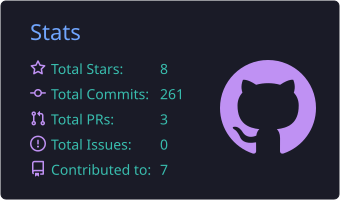
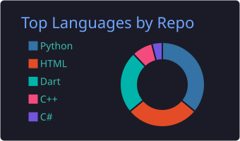
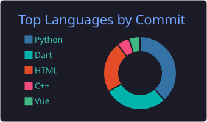
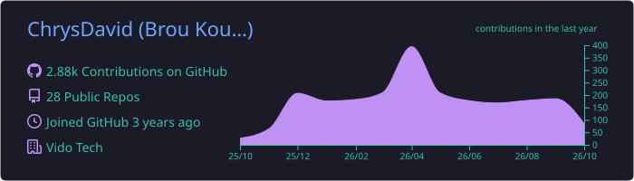

<div align="center">


<a href="https://github.com/ChrysDavid">
  
</a>

<p>
  
  <a href="https://github.com/ChrysDavid?tab=followers">
    
  </a>
  
</p>

</div>

---

## 👨‍💻 À propos de moi

```python
class ChrysDavid:
    def __init__(self):
        self.name      = "Kouamé Chrys David Brou"
        self.role      = "Full Stack & Mobile Developer (Freelance)"
        self.education = "Licence en Génie Logiciel — Institut Ivoirien de Technologie (IIT)"
        self.location  = "Grand-Bassam, Côte d'Ivoire 🇨🇮"
        self.languages = ["Français", "English"]
        self.stack     = ["Django", "Flutter", "Vue.js", "Node.js", "Firebase", "MySQL"]
        self.ai_tools  = ["Claude", "GitHub Copilot", "ChatGPT"]
        self.portfolio = "https://portfolio-chrys-david.onrender.com/"

    def current_focus(self):
        return "Plusieurs projets en parallèle, chacun sur un stack différent, accélérés par l'IA."

print(ChrysDavid().current_focus())
```

---

## 🚀 Stack Technique

**Langages**


**Mobile**


**Web**


**Bases de données**


**IA**


- 🧠 Génération et revue de code assistée
- 💬 Intégration de chatbots dans des apps web/mobile
- 📊 Analyse de données et automatisation Python + IA
- 🔍 Prompt engineering pour des workflows sur mesure

**Design & CMS**


**Outils**


---

## 📊 GitHub Stats

<div align="center">









</div>

---

## 🧩 Projets en vedette

> 🔗 Tous mes projets sur **[mon portfolio](https://brou-kouame-chrys-david.onrender.com/)**

<table>
  <tr>
    <td width="50%" valign="top">
      <h3>🕵️ VidoHacker</h3>
      <p><strong>Plateforme de compétition en cybersécurité</strong> — CTF, challenges de hacking éthique et classements pour la communauté francophone.</p>
      <p>
        
        
        
      </p>
      <p><strong>🔐 Web App · CTF · Cybersécurité</strong></p>
    </td>
    <td width="50%" valign="top">
      <h3>🎓 VidoScool</h3>
      <p><strong>App mobile d'orientation pour les jeunes Africains</strong> — découvrir sa vocation, choisir sa filière et construire son projet de carrière.</p>
      <p>
        
        
        
      </p>
      <p><strong>📱 Mobile · Éducation · Afrique</strong></p>
    </td>
  </tr>
</table>

| Projet | Description | Stack |
| --- | --- | --- |
| 🌐 **Portfolio** | Site personnel responsive | Django · HTML · CSS |
| 🛒 **E-commerce** | Boutique en ligne avec panier et paiement | Vue.js · Node.js · MySQL |
| 🤖 **AI Chatbot** | Assistant intelligent intégré dans une app web | Python · Django · API LLM |
| 📊 **Dashboard** | Tableau de bord analytique interactif | Vue.js · Express · Chart.js |

---

## 📈 Activité

<div align="center">
  <picture>
    <source media="(prefers-color-scheme: dark)" srcset="https://raw.githubusercontent.com/ChrysDavid/ChrysDavid/output/github-snake-dark.svg" />
    
  </picture>
</div>

---

## 🌍 Me contacter

<div align="center">

[](https://portfolio-chrys-david.onrender.com/)
[](https://www.linkedin.com/in/kouam%C3%A9-chrys-david-brou-45b8582a1/)
[](https://github.com/ChrysDavid)
[](https://www.facebook.com/share/XK7gyN6QzyoZgdMP/)
[](https://www.instagram.com/vido_84/)
[](https://www.tiktok.com/@chrysdavid)

**💼 Disponible pour des projets freelance & collaborations**


</div>
